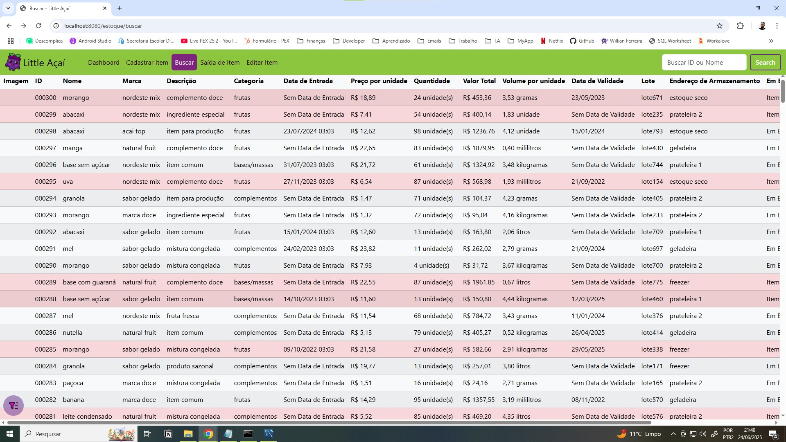
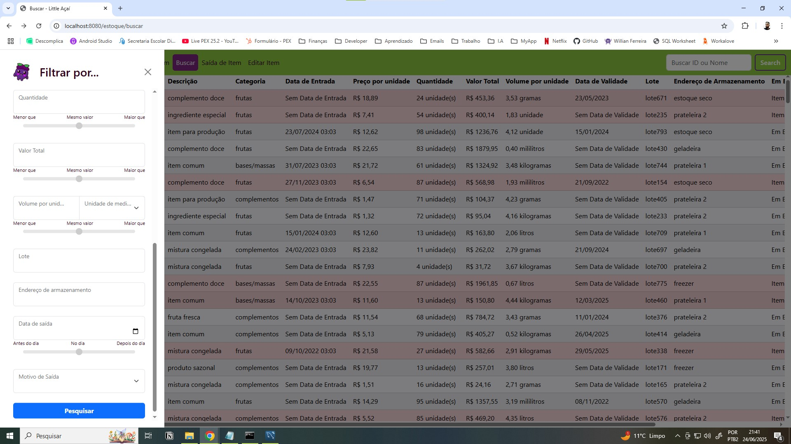

# 🍧 De Little a Big Açaí

> Sistema Fullstack desenvolvido para a microempresa **Little Açaí**, com foco na melhoria do controle operacional e suporte ao crescimento sustentável do negócio.
> A **Little Açaí** é uma microempresa delivery especializada em açaí. Fundada no início de 2025 e administrada por um casal de mulheres em Veleiros, zona sul de São Paulo.

---

## ✍️ Sobre o Projeto

Após uma análise interna detalhada, foram identificados alguns desafios enfrentados pela Little Açaí, como:

- Controle de estoque
- Registro de vendas
- Cadastro e gestão de clientes

O projeto **De Little a Big Açaí** foi desenvolvido com o objetivo de solucionar esses problemas por meio de uma aplicação web moderna, responsiva e de fácil utilização.

Este sistema foi idealizado, desenvolvido e mantido **integralmente por mim, Willian Ferreira**, como desenvolvedor fullstack. Envolve desde a modelagem do banco de dados até a interface do usuário, API REST e integrações com o backend.

> ⚠️ Este repositório está hospedado no meu GitHub pessoal para fins de portfólio profissional.  
> Foi desenvolvido exclusivamente para a microempresa **Little Açaí**, com permissão para exibição pública.

Com a implementação dessas soluções, espera-se que a Little Açaí aumente sua eficiência operacional, melhore a previsibilidade financeira e fortaleça o relacionamento com os clientes. O projeto também se alinha aos princípios da **ODS 8 – Trabalho Decente e Crescimento Econômico**.

---

## 🧩 Tecnologias Utilizadas

### Frontend
- React.js
- Bootstrap 5
- Fetch API
- React Router DOM

### Backend
- Spring Boot (Java)
- API RESTful
- JPA / Hibernate

### Banco de Dados
- MySQL

### Outros
- Git e GitHub
- Deploy (em breve)
- Cloudflare Tunnel (para ambiente local)

---

## 🚀 Funcionalidades

- 📦 Cadastro e gerenciamento de produtos no estoque *(em desenvolvimento)*
- 🧾 Registro de vendas com cálculo automático
- 👥 Cadastro e busca de clientes
- 🔐 Autenticação de usuários 
- 📊 Painel administrativo com listagens e filtros
- 📱 Layout responsiva

---

## 🔧 Como Rodar o Projeto

### Backend
```bash
# Clone o repositório
git clone https://github.com/...
cd backend

# # Execute com Maven (Windows)
mvnw.cmd spring-boot:run
```

### Frontend
```bash
# Clone o repositório
git clone https://github.com/...
cd frontend

# Instale as dependências
npm install

# Rode o servidor de desenvolvimento
npm run dev
```

## 📸 Imagens
<p float="left">        </p>

## 👨‍💻 Desenvolvedor
Este projeto foi desenvolvido integralmente por:

**Willian Ferreira**  
[LinkedIn](https://www.linkedin.com/in/willian-ferreira-gomes-705483214/) • [GitHub](https://github.com/WillianFerreira-96) • E-mail: willian.ferreira.gomes96@gmail.com
